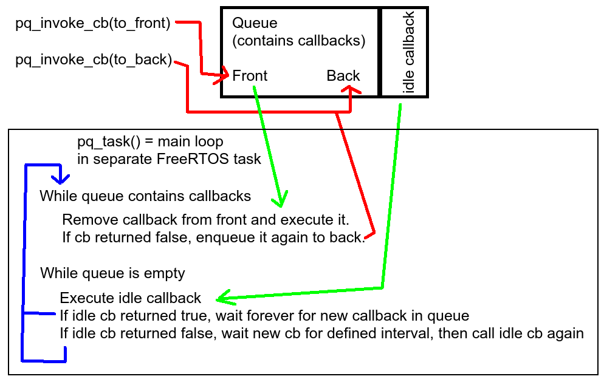
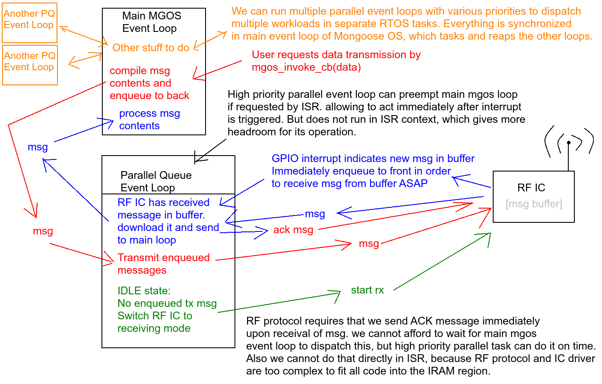

# Parallel event loop queue module for Mongoose OS

> Wow! It's literally like running ten Mongooses on single machine. Simply Fantastic!
>
> ~~ Nikola Tesla

## Quick explanation

I've came up with relatively elegant and simple (~120 LoC) solution, which offers way to simultaneously handle tasks with both extremely high and extremely low priority. (extremely medium priority is possible as well of course :-)

It is great adition to the mongoose os ecosystem, since it allows to do parallel processing using familiar API concepts similar to `mgos_invoke_cb()`.

This solution is already used in commercialy available products. The API might be improved in future releases, but the code provides stable performance, which is easily auditable given its simplicity.

It looks like this from user perspective:

```C
  //Configure some basic parameters
  pq_handle pqh; //PQH = Parallel Queue Handle
    pq_set_defaults(&pqh);
    pqh.name = "MyPQTask";
    pqh.prio = MGOS_TASK_PRIORITY+1;
    pqh.idle_interval_ms = 6000;
    pqh.idle_cb = idle_cb;
    pqh.idle_cb_arg = "IDLE ARG";

  //Create new FreeRTOS task running new FreeRTOS queue based event loop very similar to mongoose os
  pq_start(&pqh);

  //Invoke callback same way the mgos_invoke_cb() does
  pq_invoke_cb(&pqh, pq_test_cb, NULL, (void *)"CB ARG", false, false);
```

## Pros and Cons

Benefits when compared to original mongoose event loop:
  * Can have multiple event loops with various priorities and yes, they will preempt each other even when callback is still running.
  * Each mongoose module can run its own event loop without blocking other modules with higher priority or being blocked by low-priority modules.
  * This is especialy useful when you have one queue per hardware resource, so every request to claim that resource is enqueued and asynchronously dispatched as soon as possible without blocking the main loop while waiting for that resource.
  * Can use invoke_cb() parameter to do xQueueSend "to FRONT" instead of "to BACK" for task with extreme priority to get even more priority than the other events in high-priority task (use this responsibly!)
  * If needed i can reimplement original mongoose event loop API using few single line #define macros. (features of original mongoose event loop are subset of this new event loop features)
  * Each queue can optionaly register IDLE callback with custom timeout. So when there is no event in the queue, it will automaticaly run the idle callback to do some "housekeeping" tasks with extremely low priority.
  * Each callback has boolean return value. False means it should be enqueued/run again. True means it is done. In case of IDLE callback, the return value of true will suspend idling until next event.
  * Can possibly perform FreeRTOS task management (eg. pause one specific event loop and later restart it, etc...)
  * Currently the code is provided in the form of mongoose module, which can be reused by other modules. but code can be easily integrated to mongoose core to work as both API for 3rd party modules and replacement for current mongoose os event loop.
  * Whole concept has been modeled on real-life scenarios that we runned into while developing several different modules
  * I am willing to provide the code once it will get sufficiently documented and battle-tested.

Drawbacks:
  * You have to store the queue handles somewhere, otherwise you will not know which queue you are sending events to. But for main mgos_invoke_cb you can have queue handle stored as global variable, so there would be no change in API.
  * You need to think about thread safety a bit, when using multiple tasks. But queues help with synchronization anyway if used properly... Eg.: use one event loop privately for your module and use main mongoose queue only for communication with other modules.
  * One has to make sure to feed watchdog when spending too much time in high priority tasks which preempt watchdog feeding in main event loop.
  * Currently there are no timers like `mgos_set_timer(...)` to generate events in individual queues, so legacy API has to be used yet...

Can i expect some will to adopt this code on the upstream side? Be it as module or integral part of os core...


## TODO

  * Add support for timers and gpio interrupts directly tasking the parallel queues?
  * Create wrapper around `LOG()` which will show FreeRTOS task name (in adition to __FILE__ and __LINE__)
  * Add possibility to finely prioritize tasks in the queue (multiple queues per loop?). Currently we only have "to front", "to back" and "idle".
  * Add possibility for one queue to be dispatched by multiple loops on multiple cpu cores (not sure if good idea, will need more complex synchronization)
  * Pass legacy callback pointers as union?
  * Get merged directly to mongoose os.
    * See mgos_task() and mgos_invoke_cb() in https://github.com/mongoose-os-libs/freertos/blob/master/src/mgos_freertos.c
    * No need to have two separate codebases for the same thing
    * Main mongoose loop is just special case of parallel loop (using subset of pq features).

## Quick explanation of how parallel loop works

It is basicaly the same thing as the main mongoose event loop, which receives and executes callbacks sent using `mgos_invoke_cb()`.
Main difference is that you can have as many of such loops as you wish. All running in parallel.



## Example of usage

I was working on RF protocol and dispatched everything in main mongoose event loop. But some of the operations were too time demanding.
We were not able to handle the RF communication in required time frame and LCD screen was freezed during the communication.
So i quickly realized that we need to move this to separate FreeRTOS task. However i liked the mongoose callback event loop architecture.
So i made myself the same thing, but parallelized into multiple tasks, so i can run multiple such loops at the same time.
Now when some callbacks takes time to finish, it does not block callbacks in other loops from being executed.

Also i must been taking care that any event/callback which does RF communication always calls code to switch RF IC back to receiving mode after it finishes.
Parallel queues have thing called "idle callback", which can be used to immediately switch back to receiving mode once there are no transmissions in queue.
This simplifies the code and does not switch to receiving mode when there is already new transmission enqueued after the current one.
Also we can use the idle callback to execute some RF-related housekeeping tasks, in case RF traffic has been silent for few minutes.



## See also

  * https://github.com/cesanta/mongoose-os/issues/537#issuecomment-703094198
